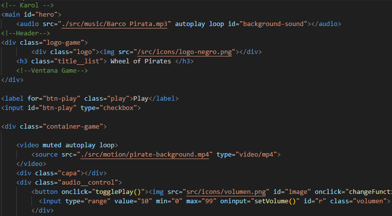
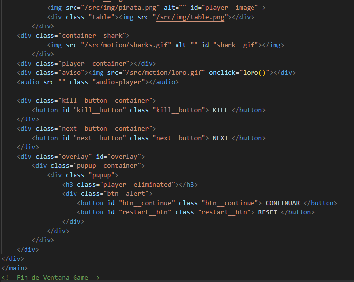
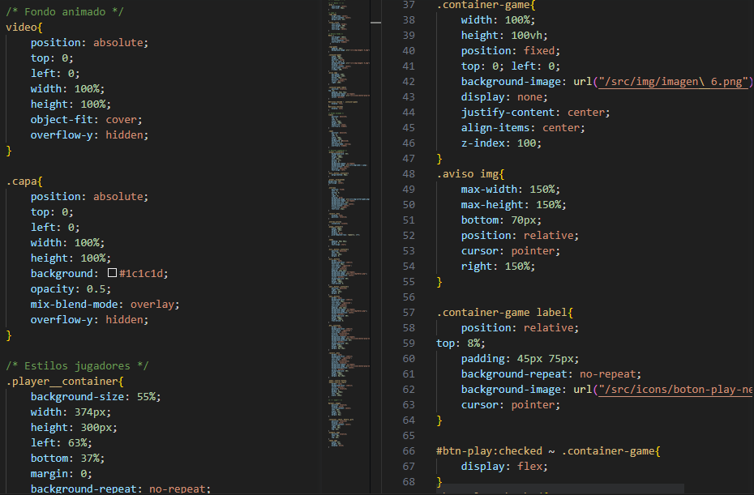
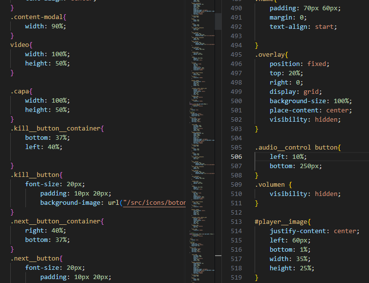
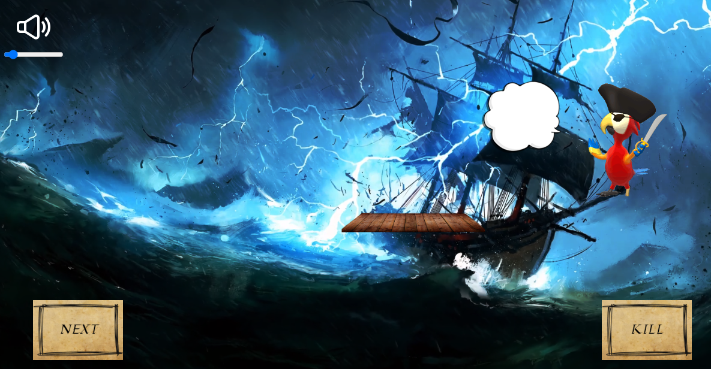
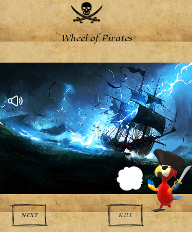
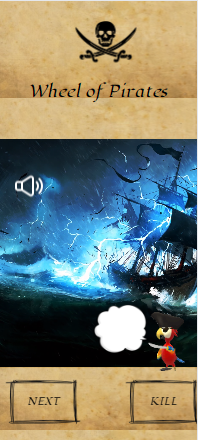

# Wheel of doom☠️🏴‍☠️
Maquetado de la página del juego HTML:

En este apartado se uso una ventana modal para presentar una pantalla de carga del juego que contiene el checkbox "PLAY", depende del dispositivo se esconde o se implementa como un header.

Dentro de la ventana game se encuentra la animación, la salida de los nombres en pantalla y el aviso pop up una vez se haya la realizado la acción por el usuario "KILL"

Estilos generales de la página game para escritorio con valores que se ajustan al tamaño de las pantallas según correspondan.

Estilos de grid para version mobile y tablet basados en los estilos generales.

Vista Game Desktop:

Vista Game Tablet:

Vista Game Mobile:

